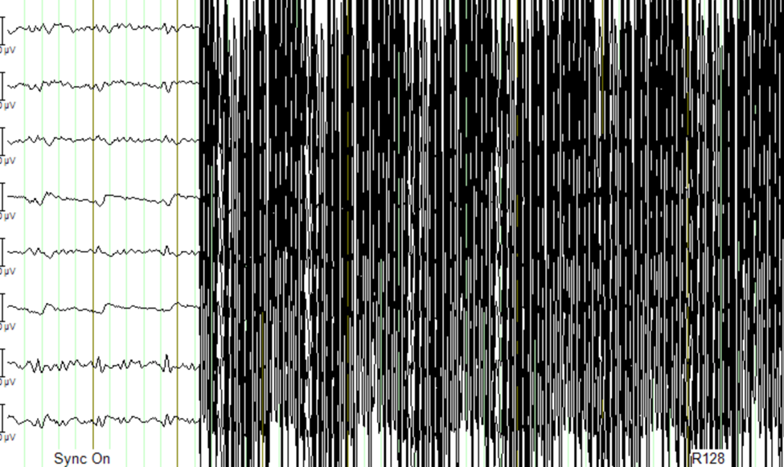

EEG-fMRI system Operational Protocol
====================================

This page provides data on the operational protocol for the EEG-fMRI system at NYUAD.
The protocol describes the data acquisition process.

Context
#######

Activation of the product
-------------------------

- The permanent licenses are on two dongles and electronic

Hardware setup
--------------
- Physical interface of the hardware:
  - Two amps connected to battery power supply and also to the Syncbox through fiber optics.
  - Battery power supply must be charged after each experiment
  - Recording computer is connected via two USB cables to the Syncbox
  - The recording computer can be put in the EEG mockup room to prepare participants prior to an experiment

Software stack
--------------

- BrainVision Recorder: data acquisition software that connects to the amplifiers and cap
- BrainVision RecView: NA
- BrainVision Analyzer: post-processing software for artifact removal, filtering and so on

Typical EEG-fMRI dataset structure
----------------------------------

- An .eeg file: raw data from the electrodes.
- A .vhdr or .xhdr file: a header containing metadata on parameters and sensors.
- A .xmrk file: contains markers with their time (can be opened in a text file).

Demo dataset has been provided by BP and are available on the recording computer:

- In the S1-EEGfMRI dataset, at some point in time we can see the gradient artifacts
- Some EEG-fMRI jargon: history is the sequence of analysis steps and each step is a node
- BrainVision Analyser is used to perform analysis of the data after acquisition

External environment noise
--------------------------

Static field recording is important to allow removing the magnet noise
(even when we are not using fmri) ideally we record first a lot of static field data
until we understand the artifacts, then for each experiment we record atleast 1minute
of static field data for the movement artifacts.

- Collect EEG data in a static field to identify artifacts and remove them in post-processing
- This involves collecting EEG data while the participant is in the scanner but not doing any task

Data acquisition protocol
-------------------------

- Open the BrainVision recorder software in administrative mode
- File -> Open Workspace, choose a workspace

To choose a simulated environment for EEG signals

- Configuration -> Select Amplifier -> Simulated Amplifier
- Then Test Signal, This should show you sinusoidal test signals

Pre-processing steps should involve:
------------------------------------
1. Inspecting the static field data.
2. Gradient-artifact correction.
3. ECG correction or CWL regression (Cardioballistic artifacts).
4. Classic EEG analysis.

Post-processing
###############

Helium Pump Noise:
------------------
- Components around the 50Hz frequency should appear in all channels.
- The helium pumps cannot be turned off during an experiment.

Ventilation System:
-------------------

- Usually causes a higher peak at 50Hz in FFT, with more spread-out noise across high-frequency components.

Markers and Timing Verification:
--------------------------------

The marker verification allows us to see if any TR's are not being marked correctly

- **Marker Verification** needs to be downloaded separately to the BP software
- If max and min in marker verification are very far apart, it means a marker is missing

Gradient Artifact:
------------------

- Occurs during fMRI data acquisition (while acquiring volume).
- In Analyzer, use **average artifact subtraction** to remove the gradient artifact.
-	First we need to check that the EEG data is synchronized with the scanner clock (Sync On is the MRI scanner clock sync signal)
-	We need to have the R128 markers (T1 volume markers)
-	Gradient artifacts changes with channels

Movement and gradient artifact:
-------------------------------

-	Gradient artifacts will change with the movement
-	We use the sliding average to account for movement artifacts
-	Stimuli shouldn’t match the time markers

Below is an example of gradient artifacts

ECG Removal
-----------
- The subtraction method can work better than ICA, use the substraction method to remove ECG signals

Steps for noise removal and pre-processing
------------------------------------------

- Gradient artifact correction:
  - Always remove the gradient artifacts first.
  - ECG with gradient artifacts can be saturated sometimes, which means that the ECG sensor should be moved around.
  - MRI artifact correction: then pick use markers, then R128, making sure the correction is only during these triggers and not for the rest.
  - Then Next.
  - Artifact Type is always **Continuous** (interleaved was an old thing when MRI was collected for a period of time and then EEG for another period of time).
  - Enable **Baseline correction for average** (compute baseline over the whole artifact).
  - Use **sliding average calculation** to account for changes in gradient artifacts over time.
  - Do not select **Common use of all channels** for bad intervals and correlation.
  - Then next: select all EEG channels (only time we don’t use all channels is if we are measuring a specific thing).
  - Then next: deselect downsampling (we can do this later).
  - How to store data Select **store corrected data** in a cached file.

- ECG signals correction after gradient artifact cleaning:
  - Also use a **sliding average subtraction** approach (Not ICA), use ICA if there is a residual.
  - We do not have markers on the peaks (this is needed for the subtraction method).
  - We need to add **R peaks** (peaks on the ECG signals).
  - After the gradient artifact correction, some high-frequency noise stays in the ECG channel during MRI acquisition.
  - Apply **High Cutoff Frequency**: go to **Transformations**, then **IIR filter**, disable the Low cutoff and High cutoff of all channels, then select only the ECG channel and apply a high cutoff (15 Hz), then apply filter.
  - Then **Transformations**, **Special Signal Processing**, then **CB correction**.
  - Choose the **ECG channel** (if it's a clear heartbeat, if not use another EEG channel that shows a clearer one than ECG).
  - Go through the manual check if the automatic analyzer skipped some R peaks.
  - After selecting all the R peaks (which should be marked in Green), click **Finish**.
  - Then the R peaks should appear on the peaks as R.
  - Go to **Special Signal Processing**, select **CB**, then select **Use Markers**, then select **R markers**.
  - Then next, and use the whole data to compute the time delay. The total number of pulses is the sliding signal window. Empirically, we use 21 as the parameters.
  - Select all EEG channels except for CWL and the ECG channel.

- Carbon Wired Loops (CWL), accounts for movement correction:
  - Change sampling rate: we need to downsample and then apply the **CWL regression**.

We can automate the process by saving all the analysis steps.

Testing and debugging
#####################

Simulated amplifier environment
-------------------------------

A simulated environment can be used to perform tests and debugging.

In BP Recorder:

- Go to configuration, then select amplifier then select simulated amplifier
- Create a new workspace and select data to be played back

